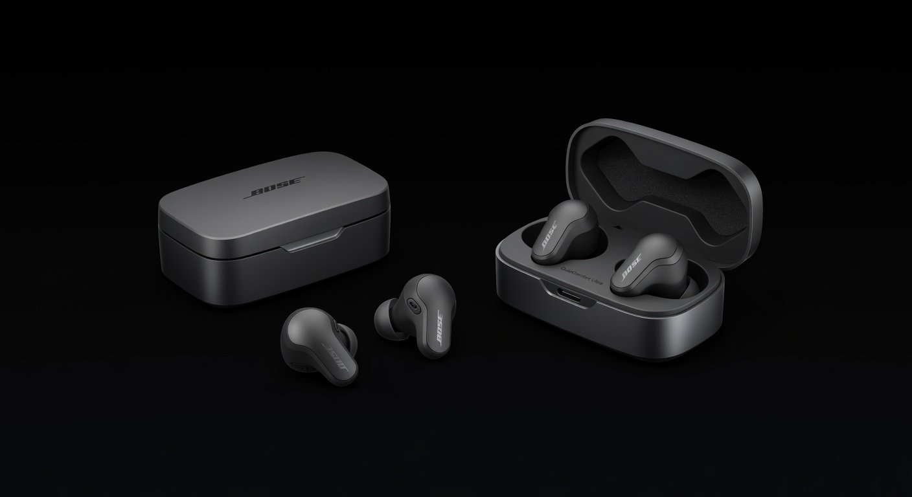

# BSTech Electronics

BSTech is a sleek, ultra-modern electronics e-commerce platform. It features a high-contrast dark interface with vibrant neon accents, designed to provide a premium shopping experience for high-tech enthusiasts.



## ✨ Core Features

- **Modern Dark Aesthetic**: A custom-designed dark theme with CSS variables and Tailwind CSS 4.
- **Dynamic Trending Page**: Replaces traditional "Bestsellers" with a curated "Trending" selection.
- **Advanced Filtering**: Sidebar with real-time filtering by brand and category.
- **Comprehensive Product Catalog**:
  - **Smartphones**: Latest mobile devices including the iPhone 16 Pro.
  - **TV & Video**: Premium displays like the "Vintage Master TV" and specialized "Precision Remotes".
  - **Home Comfort**: Smart appliances including the Smart Air Conditioner.
  - **Kitchen**: High-end retro appliances by SMEG.
  - **Audio**: World-class audio gear from Bose.
- **Interactive Product Details**: 
  - Staggered image galleries for multiple product views.
  - Feature lists and technical specifications.
  - Color variation selection.
  - "Trending" and "Sale" badges.
- **Fluid UI Transitions**: Smooth route-like transitions between the catalog and product detail views using `motion`.

## 🛠️ Technology Stack

- **Framework**: [React 19](https://react.dev/)
- **Styling**: [Tailwind CSS 4](https://tailwindcss.com/)
- **Animations**: [Motion](https://motion.dev/)
- **Icons**: [Lucide React](https://lucide.dev/)
- **Build Tool**: [Vite 6](https://vitejs.dev/)
- **Type Checking**: [TypeScript](https://www.typescriptlang.org/)

## 📁 Project Structure

- `src/components/`: Reusable UI components.
  - `Header.tsx`: Navigation bar with catalog and user controls.
  - `Sidebar.tsx`: Filter panel for brands and price ranges.
  - `ProductCard.tsx`: Grid item view for products.
  - `ProductList.tsx`: Main catalog container.
  - `ProductDetail.tsx`: Immersive single-product view.
- `src/data.ts`: Centralized product database with high-resolution local assets.
- `src/types.ts`: TypeScript interfaces for global consistency.
- `public/`: High-resolution product imagery.

## 🚀 Getting Started

### Installation

1. Clone the repository:
   ```bash
   git clone https://github.com/your-username/bstech-electronics.git
   ```

2. Install dependencies:
   ```bash
   npm install
   ```

3. Start the development server:
   ```bash
   npm run dev
   ```

### 🚢 Deployment

The project is pre-configured for **GitHub Pages**. 

1. The `.github/workflows/deploy.yml` handles automated deployment on every push to the `main` branch.
2. `vite.config.ts` uses `base: './'` to ensure asset paths resolve correctly on sub-paths.

## 📄 License

Licensed under the Apache-2.0 License.
